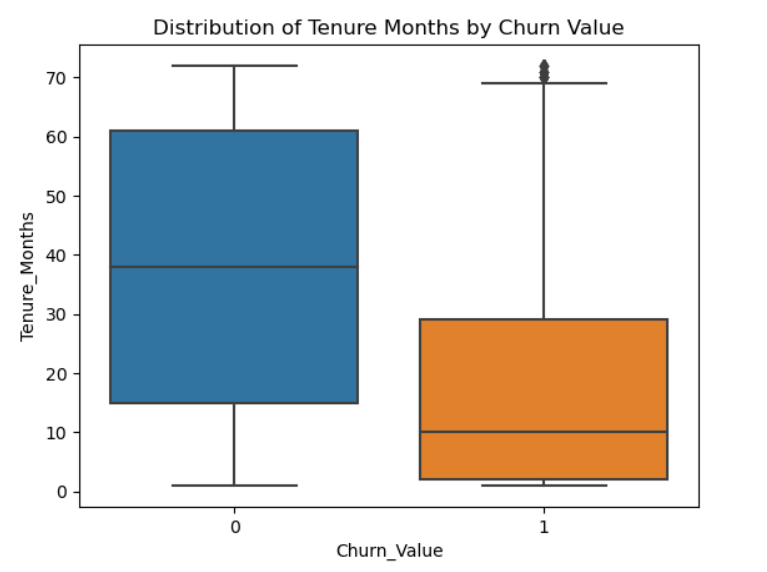
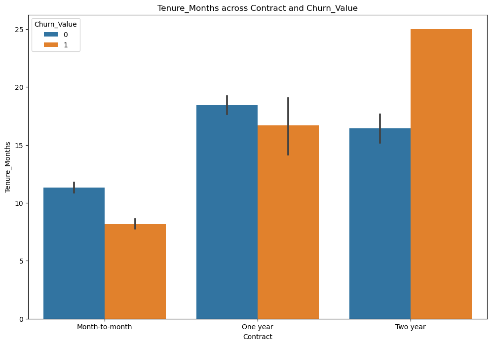
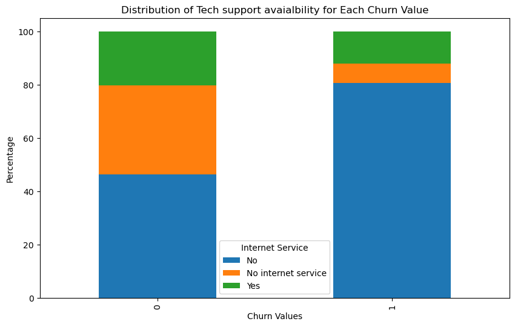
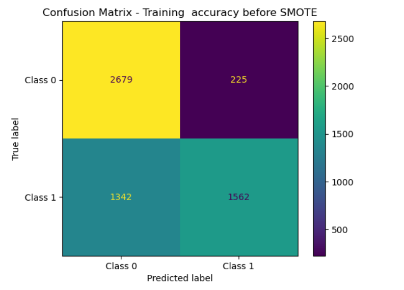
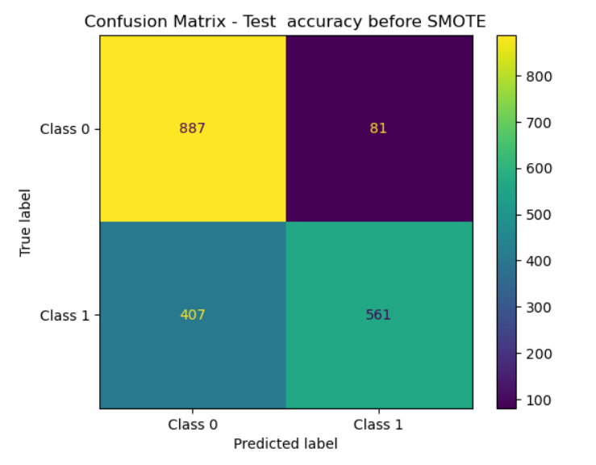
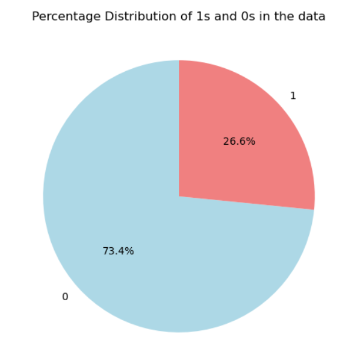
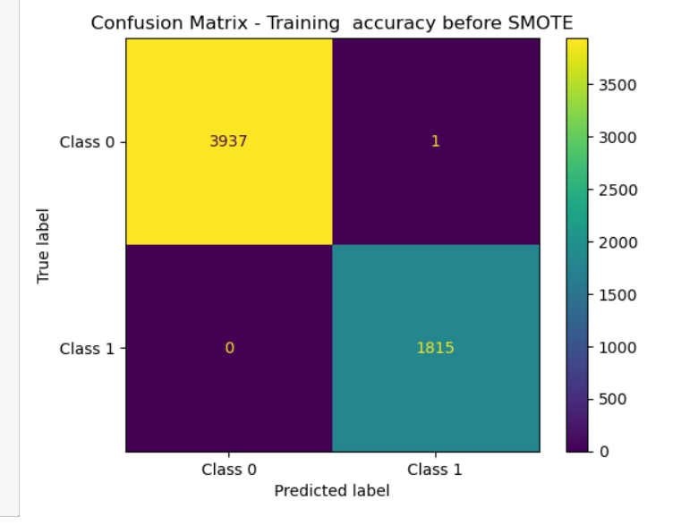
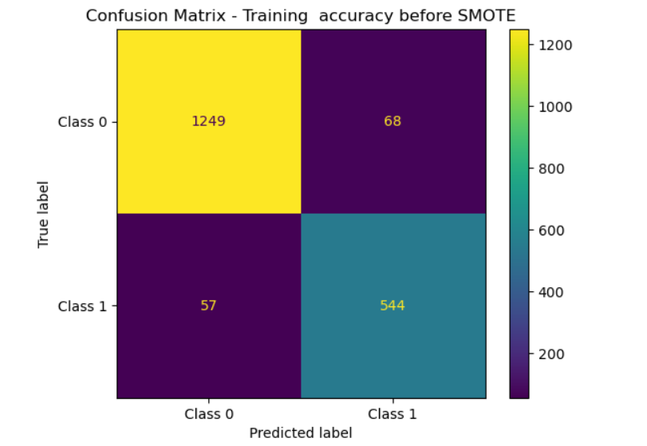

# Project 1: Predicting Customer Churn with XGBoost and SMOTE

## Overview
In this project, I applied advanced machine learning techniques to address the challenge of predicting customer churn. The primary goal was to develop a proactive system that could identify customers likely to churn, allowing for the implementation of targeted retention strategies.

## Data Preprocessing
In the data preprocessing phase, several steps were taken to clean and prepare the data for modeling:
- **Columns Removed:**
  - `Count`: Dropped because it's redundant.
  - `Churn Reason`: Dropped due to a high number of missing values.
  - `Churn Score`: Not required since this is a classification task.
  - `Churn Label`: Not needed because we have the churn value.
  - `CustomerID`: Not needed for this task.
  - `State`: Removed as it contains redundant values.
  - `Country`: Removed due to redundant values.
  - `Lat Long`: Dropped since there is another column called `Latitude`.
- **Missing Values:**
  - Rows with missing values were removed.
- **Column Names:**
  - Column names with spaces between them were replaced with underscores.
 
## Exploratory Data Analysis (EDA)
During the exploratory data analysis phase, I made intriguing observations:

- More than 90% of the customers experienced churn within 30 months of using the network.
   
      <!-- Adding line breaks for spacing -->

- Notably, customers with a 2-year contract had a significantly higher churn rate compared to those with a month-to-month contract or a one-year contract.
  
     <!-- Adding line breaks for spacing -->
  
- Approximately 80% of customers who had no tech support, device protection, and online security got churned in the first 30 months.
  
  
     <!-- Adding line breaks for spacing -->
  
## Feature Engineering
In the feature engineering phase:
- Columns with incorrect datatypes were checked and corrected.
- Columns with high cardinality were frequency encoded.
- Columns with low cardinality were converted to dummy variables.

## Machine Learning Model
The data was split into train and test sets. An XGBoost classifier was employed to build the predictive model.

## Model Performance
- **Before Addressing Class Imbalance:**
  - Initial train accuracy obtained: 83%
    

       <!-- Adding line breaks for spacing -->

  - Initial test accuracy obtained: 79%
    

       <!-- Adding line breaks for spacing -->

  - Note: There was a class imbalance in the data.
    
    
    
       <!-- Adding line breaks for spacing -->

- **After Addressing Class Imbalance with SMOTENN:**
  - Train accuracy after SMOTENN: 85%
    
    
  - Test accuracy after SMOTENN: 86%
    

These results indicate that addressing class imbalance using SMOTENN led to improved model performance on both the training and test sets.

## Technologies Used
- Jupyter Notebook
- Python
- Excel
