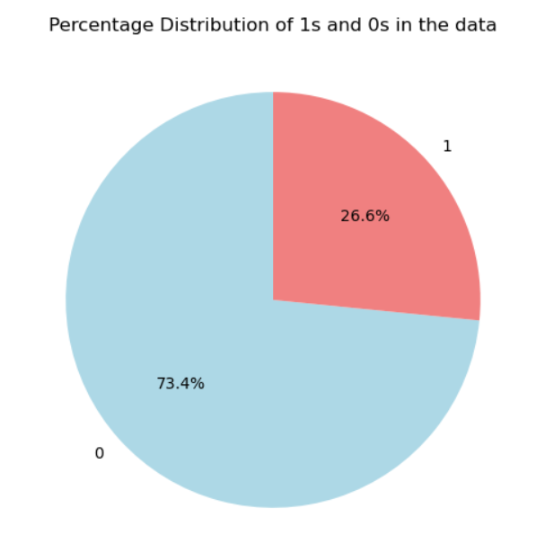
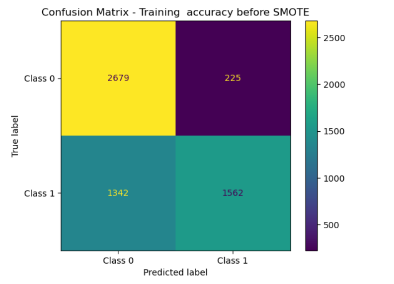
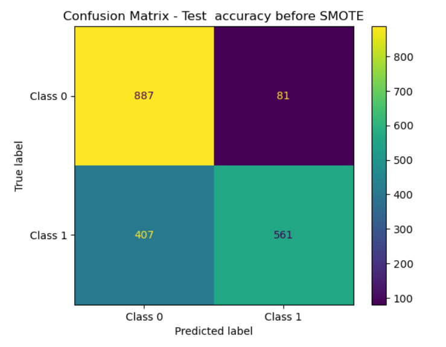
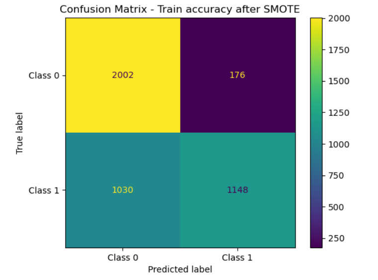
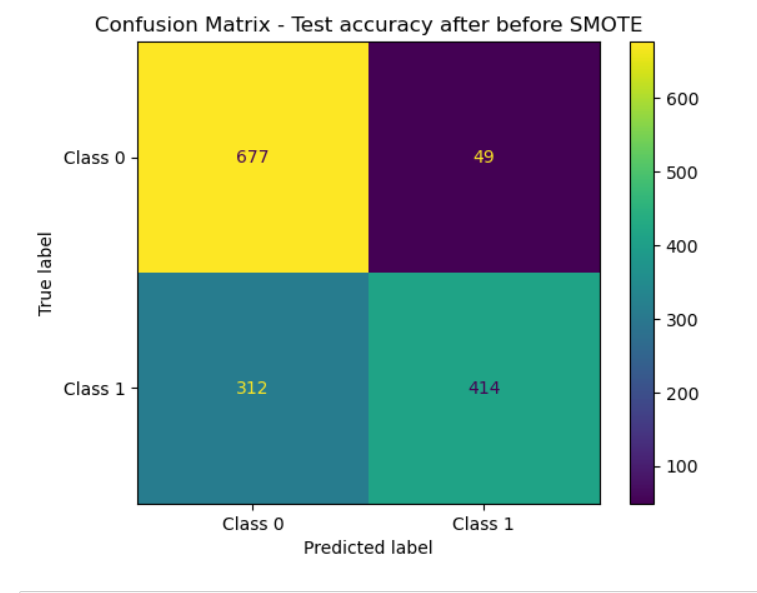

 Predicting Customer Churn with XGBoost and SMOTE

In this project, I leveraged the power of XGBoost, a robust gradient boosting algorithm, to develop a machine learning model for predicting customer churn. The objective was to proactively identify customers who might churn, enabling targeted retention strategies.

## Key Highlights:

- **Machine Learning Model:**
  - Implemented and fine-tuned an XGBoost model, known for its effectiveness in handling complex relationships within data.

- **Addressing Class Imbalance:**
  - Recognizing the challenge posed by imbalanced data, I employed the Synthetic Minority Over-sampling Technique (SMOTE). SMOTE helped balance the class distribution, preventing the model from being biased toward the majority class.
    

- **Feature Engineering:**
  - Explored and engineered relevant features to enhance the predictive capabilities of the model. Considered factors such as customer behavior, transaction history, and engagement metrics.

- **Model Evaluation and Interpretation:**
  - Rigorously evaluated the model using industry-standard metrics and techniques. Additionally, delved into model interpretation to understand the factors contributing to predictions.
    
  - Confusion matrices for train and test data
  
    
    
    
 
       <!-- Adding line breaks for spacing -->
 
    
    
    

- **Scalability and Deployment Considerations:**
  - Discussed considerations for scalability and potential deployment strategies, ensuring the model's practicality in real-world scenarios.

This project not only showcases my proficiency in machine learning and predictive modeling but also underscores my commitment to addressing real-world challenges, such as class imbalance, to deliver robust and actionable solutions.
